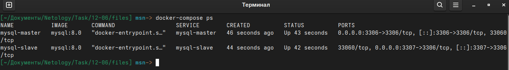
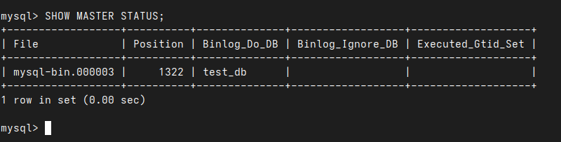
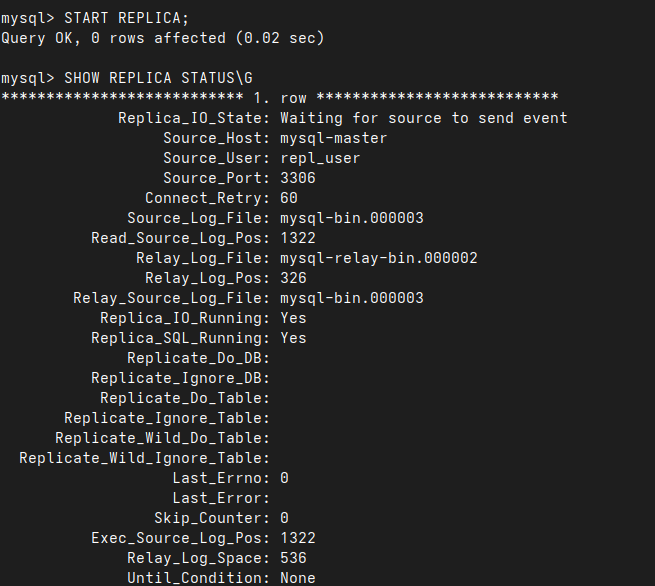

# Домашнее задание к занятию «Репликация и масштабирование. Часть 1» - Малявко Сергей (netology)

### Задание 1
На лекции рассматривались режимы репликации master-slave, master-master, опишите их различия.
Ответить в свободной форме.

### Выполнение задания 1

#### Различия между режимами репликации master-slave и master-master

1. **Master-Slave:**
   - **Роли серверов:** В этом режиме есть один главный сервер (master), который принимает все операции записи (INSERT, UPDATE, DELETE), и один или несколько подчинённых серверов (slave), которые копируют данные с master и используются для чтения (SELECT).
   - **Направление репликации:** Данные реплицируются только в одном направлении — с master на slave.
   - **Использование:** 
     - Повышение производительности за счёт распределения нагрузки: запросы на чтение обрабатываются slave, а запросы на запись — master.
     - Обеспечение отказоустойчивости: в случае падения master можно назначить один из slave новым master.
   - **Пример настройки:** На master настраивается binary log, а slave копирует изменения из этого журнала через relay log.

2. **Master-Master:**
   - **Роли серверов:** Оба сервера являются одновременно и master, и slave. Каждый сервер может принимать операции записи и реплицировать изменения на другой сервер.
   - **Направление репликации:** Данные реплицируются в обоих направлениях, что позволяет каждому серверу обновлять другой.
   - **Использование:**
     - Повышение доступности и отказоустойчивости: если один сервер выйдет из строя, второй продолжит работу.
     - Распределение нагрузки: запросы на запись могут обрабатываться любым из серверов.
   - **Особенности:** 
     - Требует более сложной настройки для избежания конфликтов (например, при одновременном изменении одних и тех же данных на обоих серверах).
     - Часто используется для географического распределения данных.

#### Ключевые различия:
- **Направление репликации:** master-slave — однонаправленная, master-master — двунаправленная.
- **Гибкость:** master-master позволяет записывать данные на любой сервер, master-slave ограничивает запись только master.
- **Сложность:** master-master сложнее в настройке и поддержке из-за возможных конфликтов данных.
- **Применение:** master-slave подходит для чтения с реплик, master-master — для распределённых систем с высокой доступностью.

### Задание 2
Выполните конфигурацию master-slave репликации, примером можно пользоваться из лекции.
Приложите скриншоты конфигурации, выполнения работы: состояния и режимы работы серверов.

### Выполнение задания 2
Выполнение через docker-compose файл по [ссылке](files/docker-compose.yml).

Конфиг mysql-master по [ссылке my.cnf](files/master/my.cnf)
Конфиг mysql-slave по [ссылке my.cnf](files/slave/my.cnf)

Подняты два контенера:
- mysql-master
- mysql-slave

Версия MySQL 8.0
Сеть между контейнерами "mysql-replication"

##### Скриншот запущенных контейненов


Входим на сервер master и cоздаём пользователя для репликации:
```sql
CREATE USER 'repl_user'@'%' IDENTIFIED BY 'repl_password';
GRANT REPLICATION SLAVE ON *.* TO 'repl_user'@'%';
FLUSH PRIVILEGES;
```
Проверка статуса Master:
```sql
SHOW MASTER STATUS;
```
##### Скриншот проверки статуса Master


Входим на сервер slave и настраевываем репликацию:
```sql
CHANGE MASTER TO
MASTER_HOST='mysql-master',
MASTER_USER='repl_user',
MASTER_PASSWORD='repl_password',
MASTER_LOG_FILE='mysql-bin.000003',
MASTER_LOG_POS=1322;
```
##### Скриншот проверки статуса Slave

